.. title:: LAB: APJ SME Portal

.. _apjsme:

-------------------
LAB: APJ SME Portal
-------------------

Launch
++++++

#. Before you start

    - one CentOS 7 VM
    - Prism Central
    - (Option) Era VM

#. Setup docker environment

    .. code-block:: bash

        sudo yum install -y yum-utils device-mapper-persistent-data lvm2
        sudo yum-config-manager --add-repo https://download.docker.com/linux/centos/docker-ce.repo
        sudo yum install -y docker-ce docker-ce-cli containerd.io
        sudo systemctl enable docker
        sudo systemctl start docker
        sudo -E usermod -a -G docker ${USER}

#. logout and relogin current user

#. download and run docker image

    .. code-block:: bash

        sudo docker pull panlm/ntnx:app2
        sudo docker run -d --name app2 -p 5000:5000 panlm/ntnx:app2

#. Open browser with your centos 7 ip address and port **5000** to access this app2. 

    - **http://x.x.x.x:5000/**

    .. figure:: images/p-login.png

#. login your mail address and any characters in password field.

    .. figure:: images/p-existed.png

#. Click **Load** to load existed settings or you could click **Inpurt** to input your Prism Central / Era credentials

Sample Screenshots
++++++++++++++++++

Dashboard
---------

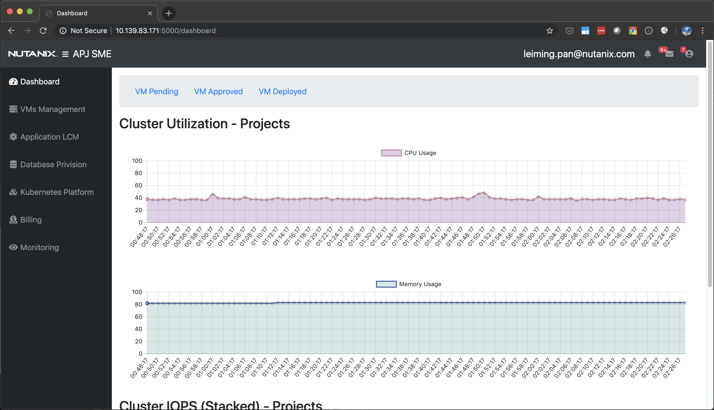

VM with approval flow
---------------------

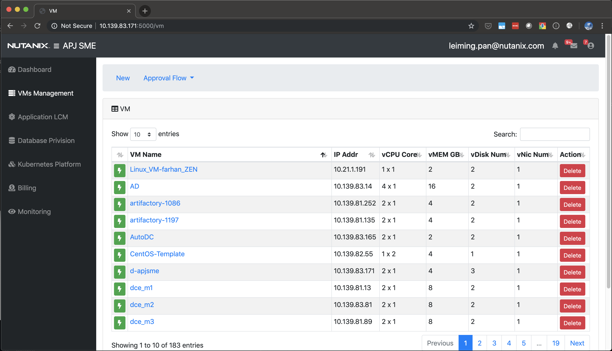

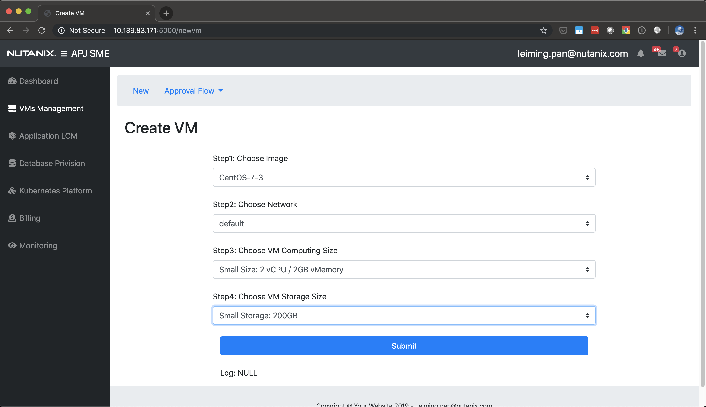

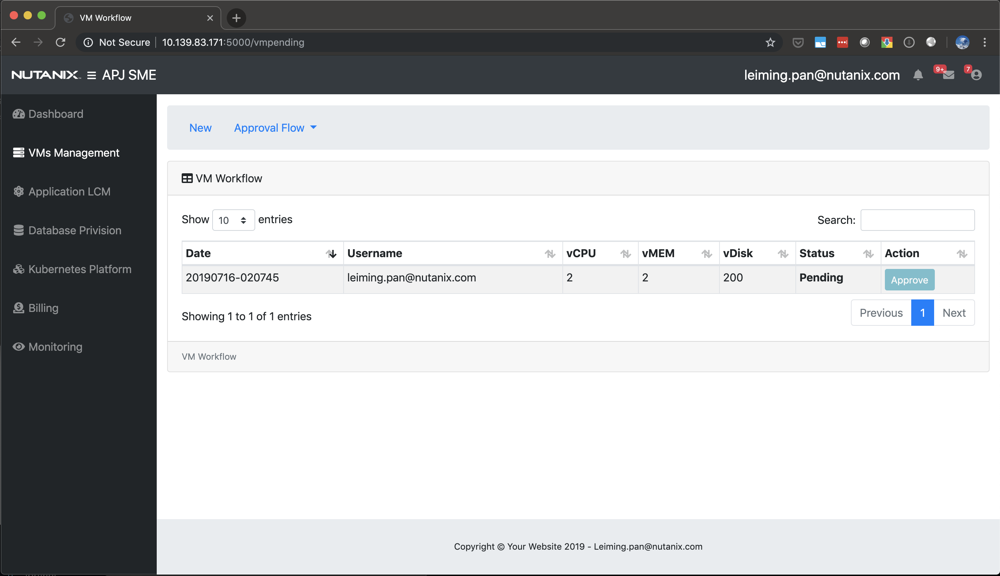

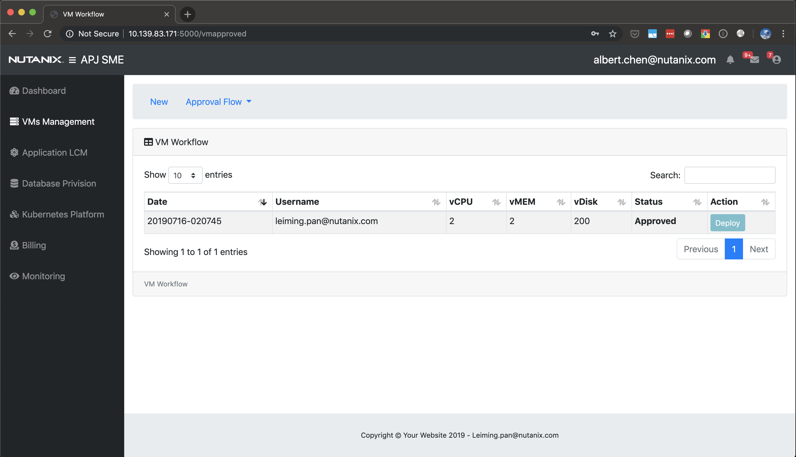

Blueprint and App
-----------------

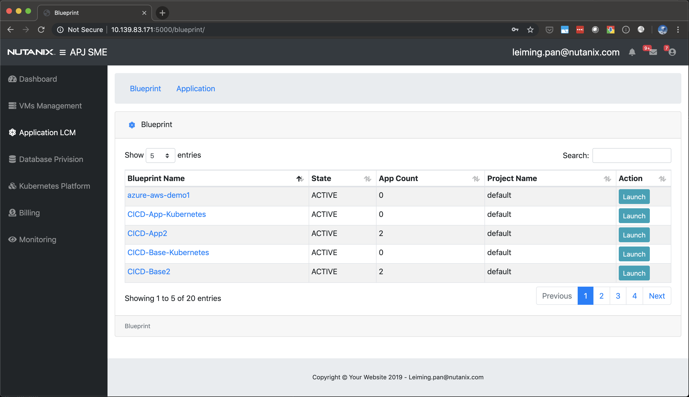

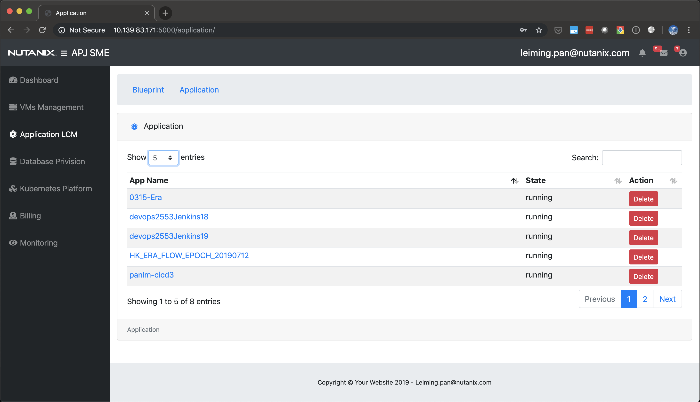

Era
---

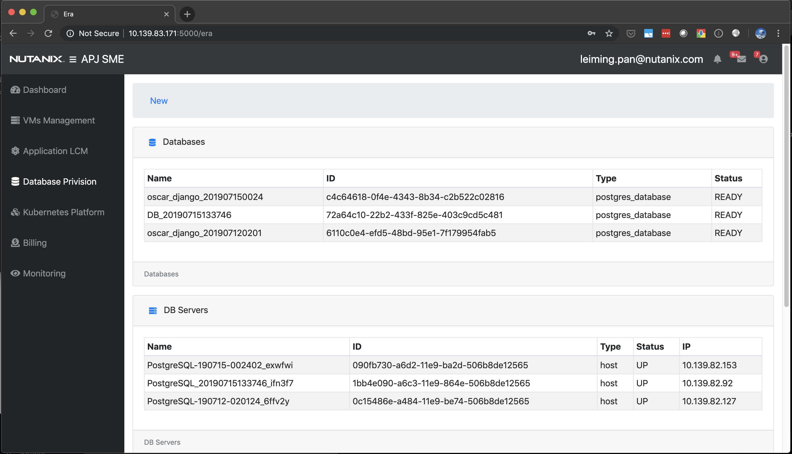

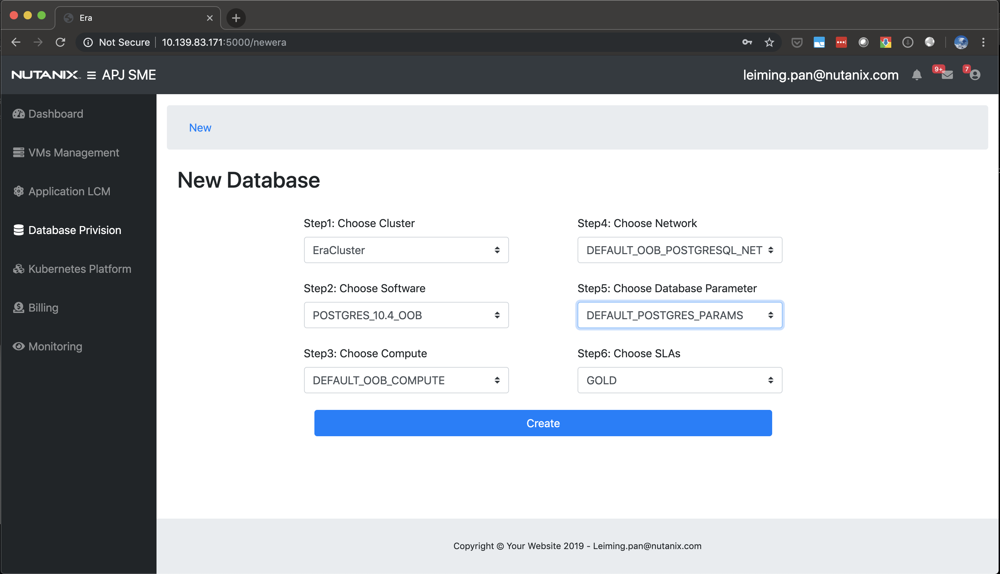

Billing
-------

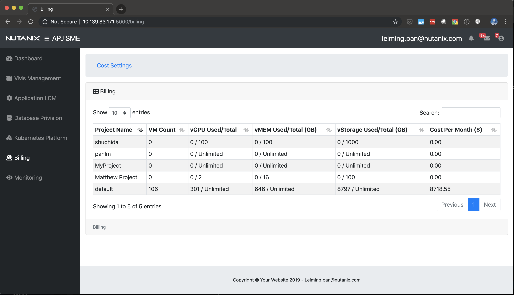

Monitoring
----------

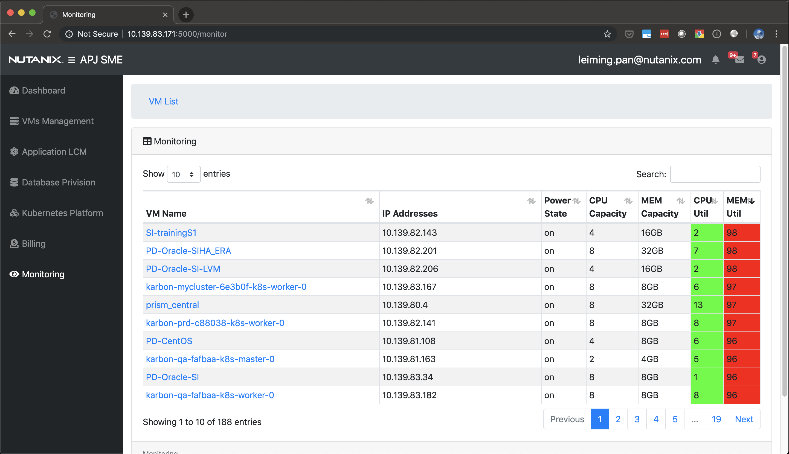

